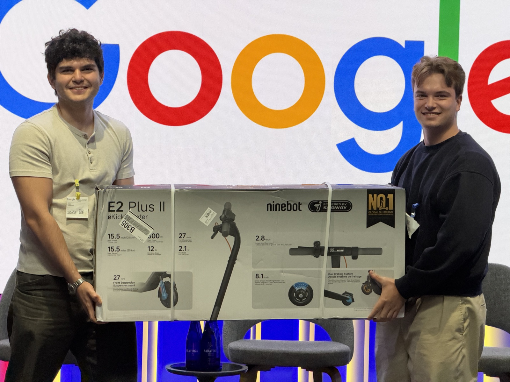
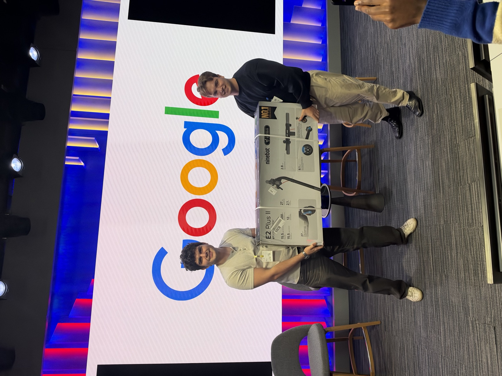
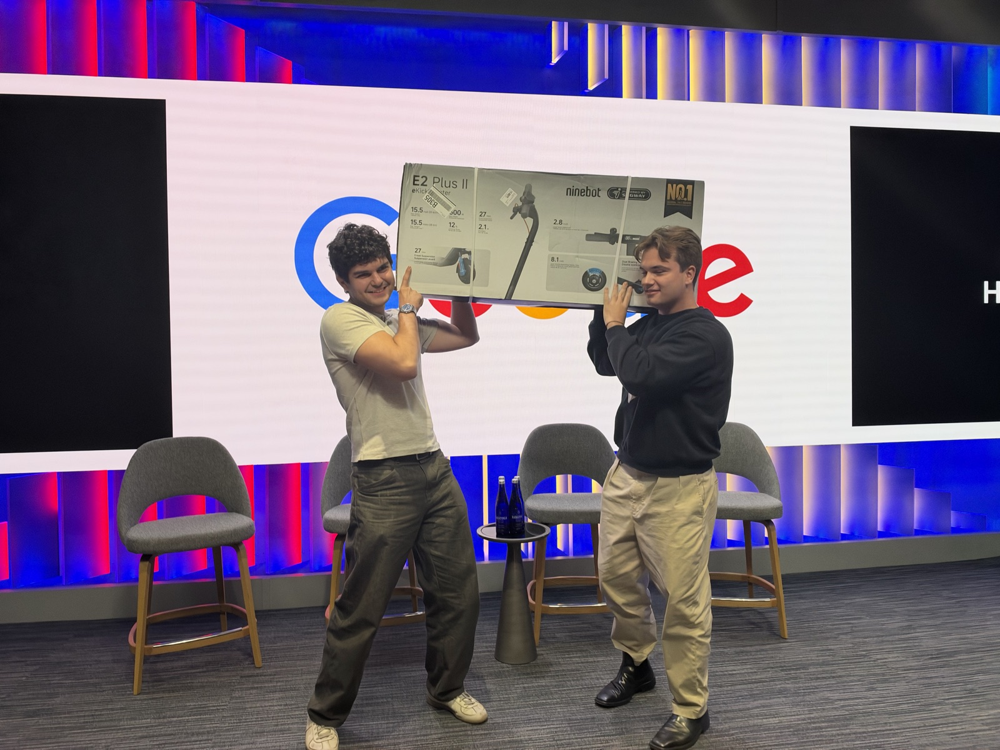
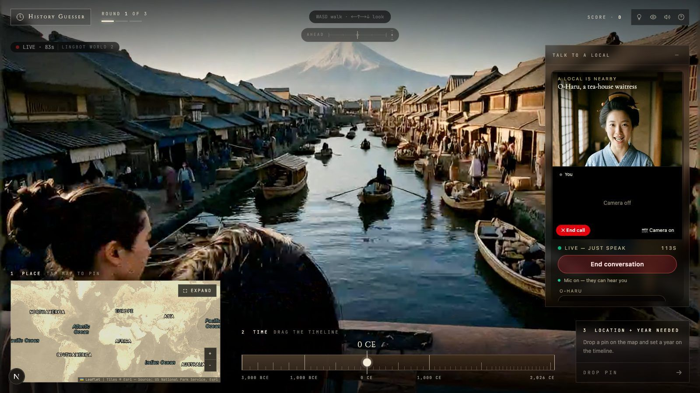
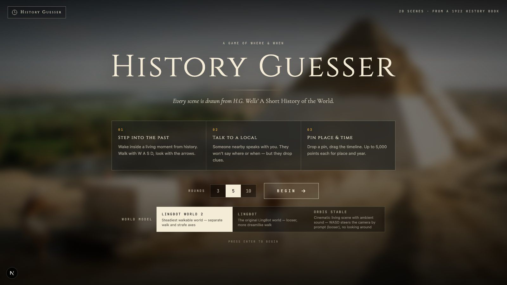
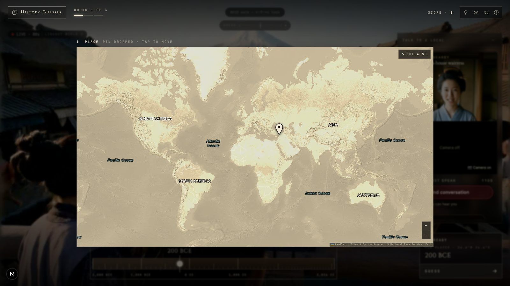
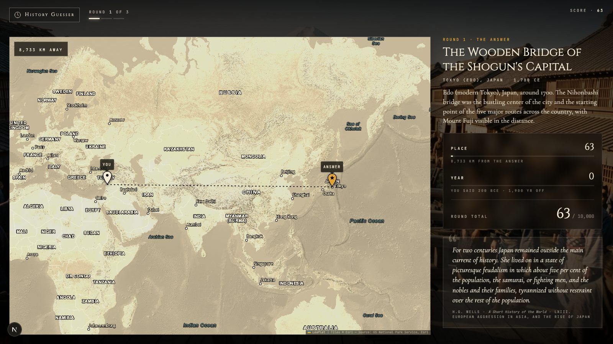
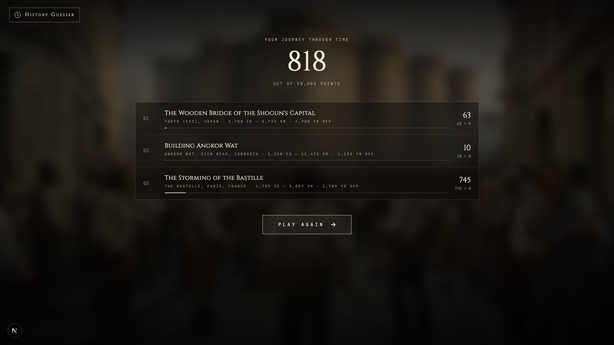
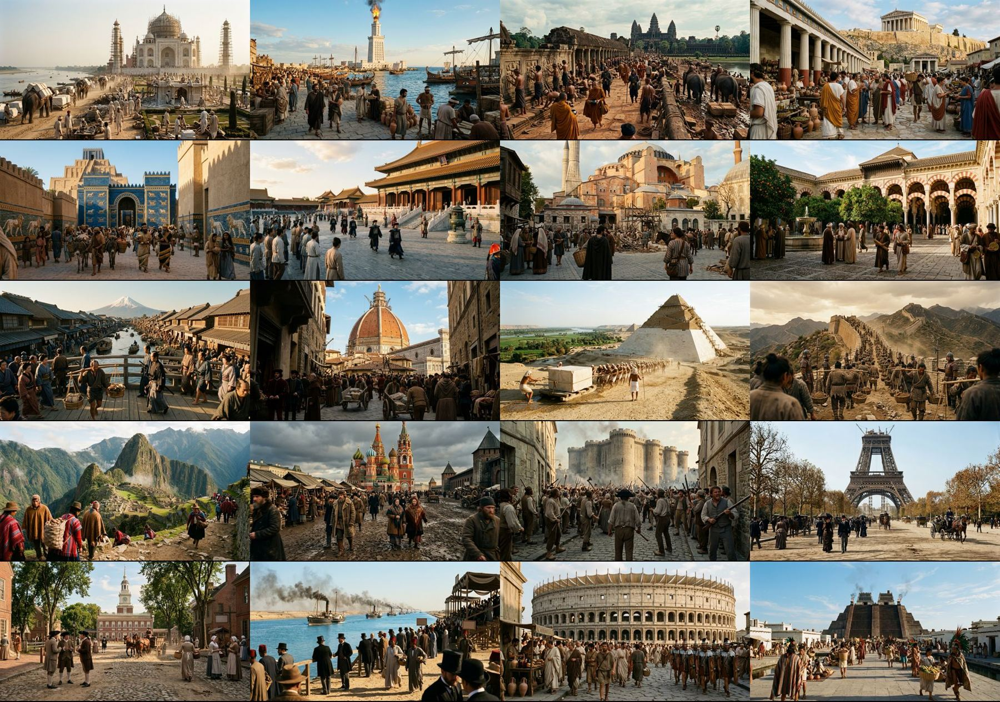
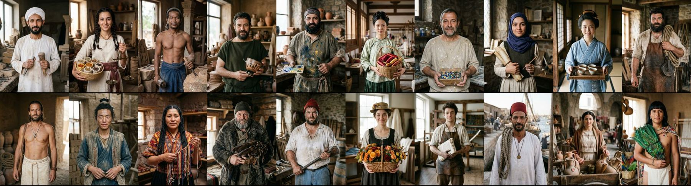

# History Guesser

## 🏆 Winner of the Reactor x Google World Models Hackathon

History Guesser won the **Reactor x Google: World Models Hackathon** at Google's NYC office (October 8, 2026).



| | |
|---|---|
|  |  |

---

**Step into a live, AI-generated moment in history, video call a local for clues, and guess where and when you are.**



## How it plays

1. **Step into the past.** You're dropped into a live, walkable scene generated in real time by a Reactor world model. Walk with **W A S D**, look around with the **arrow keys**.
2. **Talk to a local.** A stonemason, a spice vendor, a flower seller... a talking avatar of a period local picks up a video call. Ask about food, prices, gossip or who's in charge. They'll drop clues but never say where or when you are.
3. **Pin the place and the year.** Drop a pin on the parchment map and drag the timeline. Up to 5,000 points for location and 5,000 for the year.
4. **The reveal.** See how far off you were, plus the passage from H.G. Wells' *A Short History of the World* that the scene was drawn from.

| Intro | Pin your guess |
|---|---|
|  |  |
| **Reveal** | **Summary** |
|  |  |

## 20 moments, 5 continents, 4,500 years

Every scene puts you in the street as an ordinary passer-by, with one world-famous landmark in view, often brand new or still under construction: the Great Pyramid, the Ishtar Gate, the Parthenon, the Pharos of Alexandria, the Great Wall, the Colosseum, Hagia Sophia, Córdoba's Great Mosque, Angkor Wat, the Forbidden City, Brunelleschi's dome, Tenochtitlan, Machu Picchu, St Basil's, the Taj Mahal, Edo's Nihonbashi bridge, Independence Hall, the Bastille in 1789, the opening of the Suez Canal and the half-built Eiffel Tower.





## What's under the hood

| Piece | Tech | What it does |
|---|---|---|
| Walkable world | **Reactor LingBot World 2** (also LingBot and Visko Orbis Stable, selectable on the intro screen) | Turns a single image + prompt into a live, steerable video world. WASD walks, arrows look (clamped to ±100° / ±40° so the landmark never gets lost) |
| The local | **Reactor Vidu S2 Avatar** | Lip-synced video call with a period character built from a portrait. Pre-created avatars attach in ~5 s |
| Voice fallback | **Gemini Live** | Voice-only conversation if the avatar can't start |
| Historical grounding | **Gemini 3.1 Pro** | Read the whole of H.G. Wells' *A Short History of the World* (1922, public domain) and extracted 20 scenes, each with a quote verified word for word against the book |
| Scene + portrait art | **Gemini 3.1 Flash Image** (Nano Banana 2) | Painted every scene's first frame and every local's portrait in one consistent cinematic style |
| Game | Next.js 15, React 19, Tailwind 4, Leaflet | EraGuessr-style HUD, parchment map, non-linear timeline, scoring |

API keys never reach the browser: the server mints short-lived Reactor JWTs and single-use Gemini Live tokens. Every paid session has a time cap, an idle cutoff and closes when you guess.

```
data/short-history-of-the-world.txt ─▶ scripts/extract-scenes.ts (Gemini) ─▶ data/scenes.json
data/scenes.json ─▶ scripts/generate-images.ts / generate-portraits.ts (Gemini image) ─▶ public/scenes, public/locals
public/locals ─▶ scripts/prewarm-avatars.ts (Reactor avatar) ─▶ data/avatars.json

browser ─▶ /api/reactor/token ─▶ Reactor world session (image → prompt → start → WASD)
        ─▶ /api/reactor/token?model=…avatar ─▶ Reactor avatar video call (attach → start_call)
        ─▶ /api/live-token ─▶ Gemini Live (fallback)
```

## Run it

```bash
pnpm install
cp .env.example .env.local      # add GEMINI_API_KEY and REACTOR_API_KEY
pnpm dev                        # http://localhost:3000
```

- `NEXT_PUBLIC_MOCK_WORLD=1` (default in `.env.example`) shows still images instead of opening paid Reactor sessions. Set it to `0` for the live world and avatar.
- Make sure your shell doesn't export an old `GEMINI_API_KEY`: a shell variable wins over `.env.local`.

Regenerate content (all offline, results are committed):

```bash
node --env-file=.env.local scripts/extract-scenes.ts      # book → data/scenes.json
node --env-file=.env.local scripts/generate-images.ts     # scene first frames
node --env-file=.env.local scripts/generate-portraits.ts  # local portraits
node --env-file=.env.local scripts/prewarm-avatars.ts     # pre-create avatars (dev server running)
```

## More

- [`Design.md`](Design.md): every feature, the world-model comparison and design decisions
- [`LEARNINGS.md`](LEARNINGS.md): what we learned about the models and the platform along the way
- [`CLAUDE.md`](CLAUDE.md): how we split the work across two people, a merge agent and parallel coding agents
